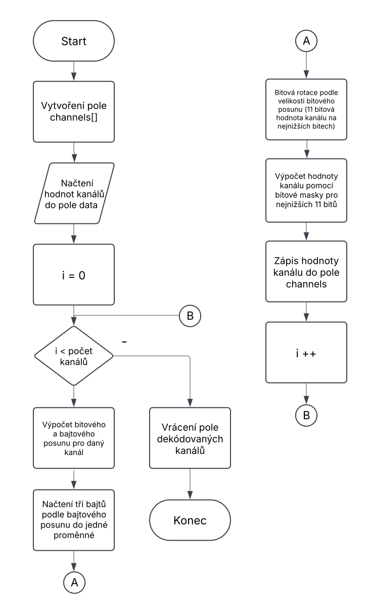

CRSF dekódování

Základní kroky pro tvorbu dekódovacího programu
1.	Inicializace UART
2.	Příjem a čtení paketu 
3.	Dekódování dat – Rozložit Payload na jednotlivé kanály
4.  Zpracování výsledku – Pomocí hodnot jednotlivých kanálů ovládat připojené periferie

Celkový CRSF paket

Přiblížený začátek paketu

Vývojový diagram dekódování

